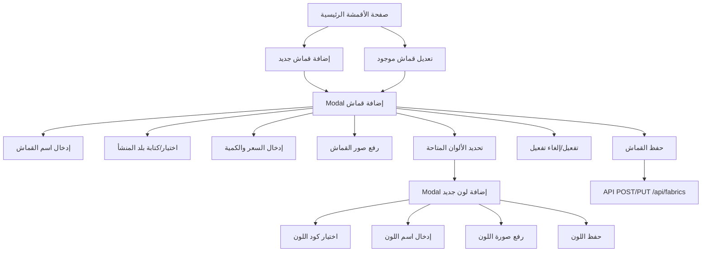

# خطة تحسين صفحة الأقمشة

## نظرة عامة
تحسين صفحة إضافة وتعديل القماش لتكون جاهزة للتسليم النهائي مع إضافة وظائف جديدة.

---

## المتطلبات المحددة

### 1. حقل بلد المنشأ (قابل للاختيار أو الكتابة)
**الحالة الحالية:** حقل `select` ثابت مع خيارات محددة مسبقاً.

**المطلوب:** تحويله إلى حقل يمكن الاختيار من قائمة أو كتابة قيمة جديدة.

**الحل المقترح:** استخدام عنصر `datalist` مع `input`:
```html
<input list="originOptions" name="origin" id="fabricOrigin" class="form-input" placeholder="اختر أو اكتب بلد المنشأ">
<datalist id="originOptions">
    <option value="🇯🇵 اليابان">
    <option value="🇬🇧 إنجلترا">
    <option value="🇪🇬 مصر">
    <!-- ... باقي الخيارات -->
</datalist>
```

---

### 2. إضافة لون جديد مع صورة
**الحالة الحالية:** 
- Modal إضافة لون موجود لكنه بسيط (اسم + كود اللون)
- لا يوجد ربط بين اللون والقماش
- لا يوجد صورة للون

**المطلوب:**
- إضافة حقل رفع صورة للون
- عند الضغط على اللون في صفحة الشراء تظهر صورته

**التغييرات المطلوبة:**

#### أ. قاعدة البيانات
إضافة حقل `image_url` لجدول `catalog.colors`:
```sql
ALTER TABLE catalog.colors ADD COLUMN image_url VARCHAR(500);
```

#### ب. Modal إضافة لون
إضافة حقل رفع صورة:
```html
<div class="form-group">
    <label class="form-label">صورة اللون</label>
    <div class="image-upload-box" id="colorImageUpload">
        <input type="file" id="colorImageInput" accept="image/*" style="display:none;">
        <!-- معاينة الصورة -->
    </div>
</div>
```

#### ج. API للألوان
إنشاء endpoints جديدة:
- `POST /api/fabrics/colors` - إضافة لون جديد
- `PUT /api/fabrics/colors/:id` - تعديل لون
- `DELETE /api/fabrics/colors/:id` - حذف لون

---

### 3. زر نشط/غير نشط
**الحالة الحالية:** زر Toggle موجود لكنه لا يحفظ القيمة.

**المطلوب:** ربط الزر مع قاعدة البيانات وإرسال القيمة عند الحفظ.

**الحل:**
- إضافة حقل `is_active` في بيانات الـ fabric المرسلة للـ API
- التأكد من أن API يدعم تحديث هذا الحقل

---

### 4. حذف قسم الألوان المتاحة من الصفحة الرئيسية
**المطلوب:** حذف القسم الموجود بين السطور 311-329 في ملف `admin/fabrics.html`:
```html
<div class="colors-section">
    <h3 class="table-title">الألوان المتاحة</h3>
    <!-- ... -->
</div>
```

---

## مخطط التدفق



---

## المهام التفصيلية

### المرحلة 1: تعديلات قاعدة البيانات
- [ ] إضافة حقل `image_url` لجدول `catalog.colors`
- [ ] إنشاء script ترحيل للبيانات الموجودة

### المرحلة 2: تعديلات API
- [ ] إضافة endpoint `POST /api/fabrics/colors` لإضافة لون
- [ ] إضافة endpoint `PUT /api/fabrics/colors/:id` لتعديل لون
- [ ] إضافة endpoint `DELETE /api/fabrics/colors/:id` لحذف لون
- [ ] تحديث endpoint حفظ القماش ليشمل `is_active`

### المرحلة 3: تعديلات الواجهة الأمامية
- [ ] تحويل حقل بلد المنشأ إلى `datalist`
- [ ] إضافة حقل رفع صورة في Modal اللون
- [ ] ربط زر نشط/غير نشط مع الحفظ
- [ ] حذف قسم الألوان المتاحة من الصفحة الرئيسية
- [ ] تحديث دالة `saveColor()` للاتصال بالـ API
- [ ] تحديث دالة `deleteColor()` للاتصال بالـ API

### المرحلة 4: الاختبار
- [ ] اختبار إضافة قماش جديد
- [ ] اختبار تعديل قماش موجود
- [ ] اختبار إضافة لون جديد مع صورة
- [ ] اختبار تعديل لون
- [ ] اختبار حذف لون
- [ ] اختبار زر نشط/غير نشط

---

## الملفات المتأثرة

| الملف | نوع التعديل |
|-------|-------------|
| `admin/fabrics.html` | تعديلات واجهة المستخدم |
| `server/routes/fabrics.js` | إضافة endpoints للألوان |
| `database/tables/catalog.sql` | إضافة حقل image_url |
| `server/scripts/add_color_image.js` | ملف جديد للترحيل |

---

## ملاحظات إضافية

1. **رفع الصور:** يمكن استخدام نفس طريقة رفع صور القماش الموجودة حالياً (Base64 أو رفع للسيرفر)

2. **الألوان في الشراء:** عند عرض القماش في صفحة الشراء، سيتم عرض صورة اللون عند النقر عليه - هذا يتطلب تعديلاً في صفحة `public/product.html`

3. **الأداء:** يفضل استخدام صور صغيرة الحجم للألوان لتسريع التحميل
