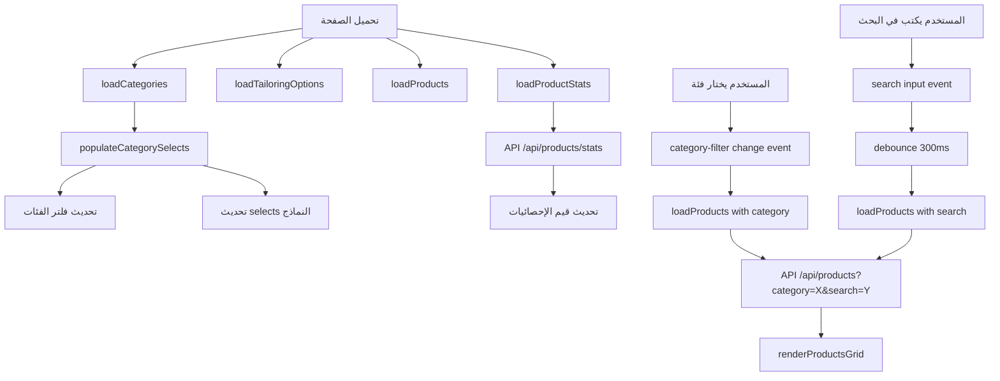

# خطة إصلاح صفحة المنتجات - Products Page Fix Plan

## ملخص التحليل

تم تحليل صفحة [`admin/products.html`](admin/products.html) والملفات المرتبطة بها، وتم اكتشاف عدة مشاكل تحتاج إلى إصلاح.

---

## المشاكل المكتشفة

### 1. ❌ الفلتر لا يعمل (Critical)

**المشكلة:**
- يوجد عنصر `<select id="category-filter">` في السطر 186
- **لا يوجد أي event listener** للاستماع لتغيير الفلتر
- الفلتر يحتوي على قيم ثابتة hardcoded:
  ```html
  <option value="classic">ثياب كلاسيكية</option>
  <option value="modern">ثياب عصرية</option>
  <option value="embroidered">ثياب مطرزة</option>
  ```
- هذه القيم تستخدم slug بينما API يتعامل مع category_id أو slug

**المطلوب:**
- إضافة event listener للفلتر
- تحميل الفئات ديناميكياً من API `/api/products/categories`
- ربط الفلتر بدالة `loadProducts()` مع تمرير الفئة المختارة

---

### 2. ❌ البحث لا يعمل (Critical)

**المشكلة:**
- يوجد حقل بحث `<input type="text" class="search-input">` في السطر 185
- **لا يوجد event listener** للاستماع للبحث
- لا يوجد ID للحقل للوصول إليه

**المطلوب:**
- إضافة ID للحقل: `id="search-input"`
- إضافة event listener للبحث مع debounce
- ربط البحث بدالة `loadProducts()` مع تمرير نص البحث

---

### 3. ❌ الإحصائيات لا تُحمّل من قاعدة البيانات (Critical)

**المشكلة:**
- يوجد عناصر للإحصائيات:
  - `stat-total-products`
  - `stat-active-products`
  - `stat-draft-products`
  - `stat-out-of-stock`
- **لا توجد دالة لتحميل الإحصائيات** من API
- API endpoint `/api/products/stats` موجود في [`server/routes/products.js`](server/routes/products.js:164) لكن لا يتم استدعاؤه

**المطلوب:**
- إضافة دالة `loadProductStats()`
- استدعاؤها عند تحميل الصفحة
- تحديث قيم الإحصائيات في الواجهة

---

### 4. ⚠️ لون الفلتر ضعيف التباين (Medium)

**المشكلة:**
- الفلتر يستخدم class `search-input` من [`css/admin.css`](css/admin.css:290)
- لون الخلفية `var(--admin-bg)` فاتح جداً في الوضع العادي
- في الوضع الداكن، التباين أفضل لكن يمكن تحسينه

**المطلوب:**
- تحسين لون خلفية الفلتر وزيادة التباين
- إضافة border أكثر وضوحاً
- تحسين المظهر في الوضع الداكن

---

### 5. ⚠️ تحميل الفئات للفلتر (Medium)

**المشكلة:**
- دالة `loadCategories()` موجودة وتجلب الفئات من API
- لكن الفئات تُستخدم فقط في نماذج الإضافة والتعديل
- فلتر الفئات في الأعلى لا يتم تحديثه من قاعدة البيانات

**المطلوب:**
- تحديث فلتر الفئات ديناميكياً بعد تحميل الفئات

---

## التعديلات المطلوبة

### الملف: [`admin/products.html`](admin/products.html)

#### 1. إضافة ID لحقل البحث (سطر 185)
```html
<!-- قبل -->
<input type="text" class="search-input" placeholder="بحث...">

<!-- بعد -->
<input type="text" class="search-input" id="product-search" placeholder="بحث...">
```

#### 2. تحديث فلتر الفئات ليكون ديناميكياً (سطر 186-191)
```html
<!-- قبل -->
<select class="search-input" id="category-filter" style="min-width:120px;">
    <option value="">كل الفئات</option>
    <option value="classic">ثياب كلاسيكية</option>
    <option value="modern">ثياب عصرية</option>
    <option value="embroidered">ثياب مطرزة</option>
</select>

<!-- بعد -->
<select class="search-input filter-select" id="category-filter" style="min-width:140px;">
    <option value="">كل الفئات</option>
    <!-- سيتم ملؤها ديناميكياً -->
</select>
```

#### 3. إضافة دالة تحميل الإحصائيات (في قسم JavaScript)
```javascript
// --- Load Product Stats ---
async function loadProductStats() {
    try {
        const res = await fetch('/api/products/stats');
        const data = await res.json();
        if (data.success) {
            document.getElementById('stat-total-products').textContent = data.data.totalProducts;
            document.getElementById('stat-active-products').textContent = data.data.activeProducts;
            document.getElementById('stat-draft-products').textContent = data.data.draftProducts;
            document.getElementById('stat-out-of-stock').textContent = data.data.outOfStock;
        }
    } catch (err) {
        console.error('Failed to load product stats', err);
    }
}
```

#### 4. تحديث دالة loadProducts لدعم الفلتر والبحث
```javascript
async function loadProducts(category = '', search = '') {
    try {
        const params = new URLSearchParams();
        if (category) params.append('category', category);
        if (search) params.append('search', search);
        
        const url = `${API_URL}?${params.toString()}`;
        const res = await fetch(url);
        const data = await res.json();

        if (data.success) {
            renderProductsGrid(data.data);
        }
    } catch (err) {
        console.error('Failed to load products', err);
    }
}
```

#### 5. إضافة Event Listeners للفلتر والبحث
```javascript
// Filter and Search Event Listeners
let searchTimeout;
document.getElementById('product-search').addEventListener('input', (e) => {
    clearTimeout(searchTimeout);
    searchTimeout = setTimeout(() => {
        const category = document.getElementById('category-filter').value;
        loadProducts(category, e.target.value);
    }, 300);
});

document.getElementById('category-filter').addEventListener('change', (e) => {
    const search = document.getElementById('product-search').value;
    loadProducts(e.target.value, search);
});
```

#### 6. تحديث دالة populateCategorySelects لتحديث فلتر الفئات
```javascript
function populateCategorySelects() {
    // تحديث فلتر الفئات في الأعلى
    const filterSelect = document.getElementById('category-filter');
    if (filterSelect) {
        filterSelect.innerHTML = '<option value="">كل الفئات</option>' + 
            categories.map(c => `<option value="${c.slug}">${c.name_ar}</option>`).join('');
    }
    
    // تحديث selects في النماذج
    const options = categories.map(c => `<option value="${c.id}">${c.name_ar}</option>`).join('');
    const addSelect = document.querySelector('#addProductForm select[name="category"]');
    if (addSelect) addSelect.innerHTML = '<option value="">اختر الفئة</option>' + options;
    
    const editSelect = document.getElementById('editCategory');
    if (editSelect) editSelect.innerHTML = options;
}
```

#### 7. تحديث DOMContentLoaded لتحميل الإحصائيات
```javascript
document.addEventListener('DOMContentLoaded', async () => {
    await loadCategories();
    await loadTailoringOptions();
    loadProducts();
    loadProductStats();  // إضافة هذا السطر
    setupImageHandling();
    setupFilterListeners(); // إضافة هذا السطر
});
```

---

### الملف: [`css/admin.css`](css/admin.css)

#### إضافة أنماط محسّنة للفلتر
```css
/* Filter Select Styles */
.filter-select {
    background-color: var(--admin-surface);
    border: 2px solid var(--admin-border);
    color: var(--admin-text);
    font-weight: 500;
    cursor: pointer;
    transition: all 0.2s;
}

.filter-select:hover {
    border-color: var(--admin-accent);
}

.filter-select:focus {
    outline: none;
    border-color: var(--admin-accent);
    box-shadow: 0 0 0 3px rgba(193, 154, 91, 0.2);
}

.dark .filter-select {
    background-color: var(--admin-surface);
    border-color: var(--admin-border);
    color: var(--admin-text);
}

.dark .filter-select option {
    background-color: var(--admin-surface);
    color: var(--admin-text);
}
```

---

## مخطط تدفق البيانات



---

## التحقق من اتصال قاعدة البيانات

### ✅ API للمنتجات
- Endpoint: `/api/products` - يعمل بشكل صحيح
- يدعم الفلترة بـ: `category`, `status`, `search`, `sizes`, `min_price`, `max_price`
- يدعم الترتيب بـ: `newest`, `price_low`, `price_high`, `popular`

### ✅ API للفئات
- Endpoint: `/api/products/categories` - يعمل بشكل صحيح
- يعيد: `id`, `name_ar`, `name_en`, `slug`, `sort_order`, `is_active`

### ✅ API للإحصائيات
- Endpoint: `/api/products/stats` - يعمل بشكل صحيح
- يعيد: `totalProducts`, `activeProducts`, `draftProducts`, `outOfStock`

### ✅ قاعدة البيانات
- جدول `catalog.products` - موجود
- جدول `catalog.categories` - موجود مع بيانات افتراضية
- جدول `catalog.colors` - موجود
- جدول `catalog.standard_sizes` - موجود

---

## ملخص المهام للتنفيذ

| # | المهمة | الأولوية | الملف |
|---|--------|----------|-------|
| 1 | إضافة ID لحقل البحث | عالية | products.html |
| 2 | إضافة دالة loadProductStats | عالية | products.html |
| 3 | تحديث loadProducts للفلترة | عالية | products.html |
| 4 | إضافة event listeners | عالية | products.html |
| 5 | تحديث populateCategorySelects | عالية | products.html |
| 6 | تحسين أنماط الفلتر | متوسطة | admin.css |
| 7 | اختبار التكامل | عالية | - |

---

## ملاحظات إضافية

1. **الوضع الداكن:** التطبيق يدعم الوضع الداكن، يجب التأكد من أن التعديلات تعمل في كلا الوضعين.

2. **الاستجابة:** الفلترة والبحث يجب أن يكونا سريعين، لذلك يُستخدم debounce للبحث.

3. **تجربة المستخدم:** يجب إضافة مؤشر تحميل أثناء جلب البيانات.

4. **الأخطاء:** يجب إضافة معالجة أخطاء مناسبة ورسائل للمستخدم.
